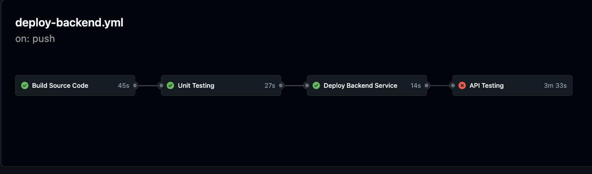

# Github Actions Pipeline to Automate Deployment and Testing
This pipeline automates building of source code, Unit Testing, Deployment of Code to ECS Clusters, and API Testing with Bruno. 

## Explanation of Each Step



## Configuration
Configure the Environment Variables in the pipeline. 

Configure the Following Secrets in Github Repo > Settings > Secrets 
```
COGNITO_CLIENT_ID=
COGNITO_REFRESH_TOKEN=
```
### Environment Description
dev > stage > prod

dev - multiple developers pushing. 
stage - successfull dev , with passing api tests. 
prod - requires admin approval

### Turn on Secret Scanning
1. On GitHub.com, navigate to the main page of your repository.
2. Under your repository name, click Settings.
3. In the left sidebar, click Code security and analysis.
4. Scroll down to Secret scanning and click Enable.

### Build 
Build The source Code, errors detected here will be compilation errors. 

### Unit Testing
Run unit test using python's pytest library to test routers, service functions with aws infrastructure, using python's [moto](https://docs.getmoto.org/en/latest/docs/getting_started.html#decorator) library. 

### Container Security Scanning
Scan the container, for security vulnerability. 

### Manual Approval
Administrative Control to approve the new deployment.

Github provides controls to require approval for jobs within their pipelines through the use of environments. For this specific example we use the **production** environment to control who can push or approve of new changes. 

### Deployment
Deploy new code changes to production environment, using blue green deployment with aws.

### API Testing
Perform End to End Testing (to verify user experience), experienced on your application. 

This example makes use of Bruno API testing (open source), to perform API requests on an API endpoint. This example allows to perform API testing for endpoint which expect Cognito issued JWT tokens.  


