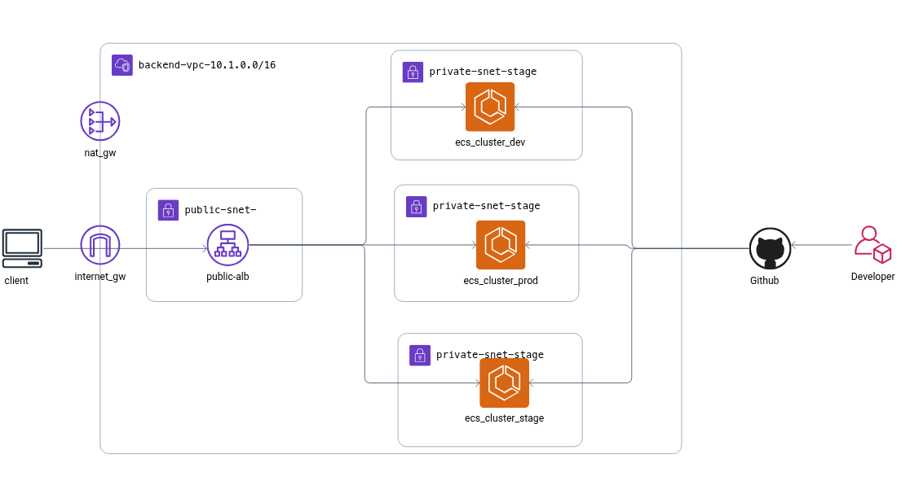
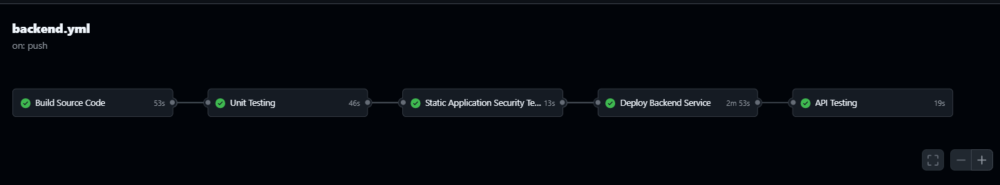
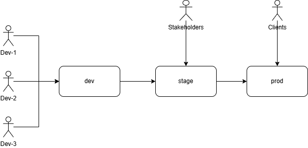

**Author** : Prabhmeet Deol

# Github Actions Pipeline to Automate Deployment and Testing
This pipeline automates building of source code, Unit Testing, Deployment of Code to ECS Clusters, and API Testing with Bruno. 

CICD Ideology, the repo acts as the source of Truth. Each branch should reflect the current environment. Each environment should protect a critical environment. 

## AWS Environment Overview


## Explanation of Each Step



## Configuration
Configure the Environment Variables in the pipeline. 

#### Configure the Following Secrets in Github Repo > Settings > Secrets.
```
COGNITO_CLIENT_ID=
COGNITO_REFRESH_TOKEN=
```

#### Configure Pipeline Environment Variables
```
AWS_REGION: us-east-1
ECR_REPOSITORY_NAME: prab-cicd-backend
ECS_SERVICE: backend
GITHUB_ACTION_IAM_ROLE: arn:aws:iam::866934333672:role/GITHUB-ACTIONS-ALL-REPO
CONTAINER_NAME: flask-api
REPO_ROOT_FOLDER_NAME: backend
UNIT_TEST_PATH: tests/unit
API_TESTS_PATH: backend/tests/api
API_BASE_URL: http://prab-cicd-api-alb-1337318245.us-east-1.elb.amazonaws.com

```

#### AWS infra creation
This infrastructure should not be managed by Terraform, since it will rarely require deletion. Or an accidental deletion of the following resources can be problematic. The following are also examples, 


1. ECR Repositories , use ```scripts/create_ecr_repo.sh```
2. Github Actions IAM role to authenticate over OIDC, use ```scripts/create_github_actions_iam_role.sh```.
3. Create Cognito Pool - This allows to authenticate API requests, at the ALB. Use script ```scripts/create_cognito_pool.sh``` 

### Environment Description


dev > stage > prod

dev - multiple developers pushing. 
stage - successfull dev , with passing api tests. 
prod - requires admin approval

### Turn on Secret Scanning
1. On GitHub.com, navigate to the main page of your repository.
2. Under your repository name, click Settings.
3. In the left sidebar, click Code security and analysis.
4. Scroll down to Secret scanning and click Enable.

## CICD Pipeline Features

### Trigger Conditions
The pipeline is triggered on pushes to the `dev`, `stage`, and `prod` branches when changes are made to the `backend/` directory or any of the task definition files under `.aws/`. It can also be triggered manually via `workflow_dispatch`. Each branch maps directly to its corresponding ECS cluster environment.

### Build
The source code is checked out at the exact commit SHA to guarantee reproducibility. A Docker image is built targeting the `linux/amd64` platform and pushed to Amazon ECR with two tags: the full commit SHA (for traceability and rollback) and `latest` (for convenience). AWS credentials are obtained via OIDC — no static keys are stored. The built image reference is passed as an output to downstream jobs.

### Container Security Scanning (Trivy)
Before any tests run, the freshly built image is scanned using [Trivy](https://github.com/aquasecurity/trivy). The scan covers both OS packages and application libraries. Any `CRITICAL` or `HIGH` severity vulnerability with a known fix will cause the job to fail, preventing a vulnerable image from progressing further in the pipeline.

### Unit Testing
The same ECR image that was built and scanned is pulled and run as a container. The pytest suite is executed inside the container against the `tests/unit` path, ensuring tests run in an environment identical to production. The container is always removed after the run, regardless of test outcome. AWS infrastructure interactions are mocked using the [moto](https://docs.getmoto.org/en/latest/docs/getting_started.html#decorator) library, allowing service functions and routers to be tested without live AWS resources.

### Static Application Security Testing (SAST)
After unit tests pass, [Semgrep](https://semgrep.dev/) performs static analysis on the source code using the `p/security-audit` ruleset. This catches common vulnerability patterns (injection flaws, insecure defaults, etc.) at the code level, before the code is ever deployed.

### Manual Approval (Production Gate)
The deploy job is tied to a GitHub Environment that matches the branch name (`dev`, `stage`, or `prod`). GitHub Environments support required reviewers — configuring reviewers on the `prod` environment enforces a manual approval step before any production deployment proceeds. No code changes are required to enable or modify this gate; it is controlled entirely through repository settings.

### Deployment
On approval, the pipeline renders the environment-specific ECS task definition JSON (referenced via the `ECS_TASK_DEFINITION` repository variable) with the new commit-SHA-tagged image. The rendered task definition is registered with ECS and deployed to the target cluster and service using `amazon-ecs-deploy-task-definition`, which waits for service stability before marking the job as successful. The deployed task definition family, revision, and full ARN are printed to the job log for auditability.

### API Testing
After a successful deployment, end-to-end API tests are executed using the [Bruno CLI](https://www.usebruno.com/). The test collection runs against the live ALB endpoint with environment-specific variables injected at runtime (`baseUrl`, `build_id`, `commit_sha`). Tests support Cognito-authenticated endpoints by passing the required JWT token via the configured Bruno environment. Failures here indicate a regression visible to end users and will mark the overall pipeline run as failed.

## Improvements

[] Test Backend Pipeline
[] Separate Cluster for each environment
[] Finish Front End Pipeline
[] Add Artifact Caching to optimize performance of the pipeline.
[] fix permission

